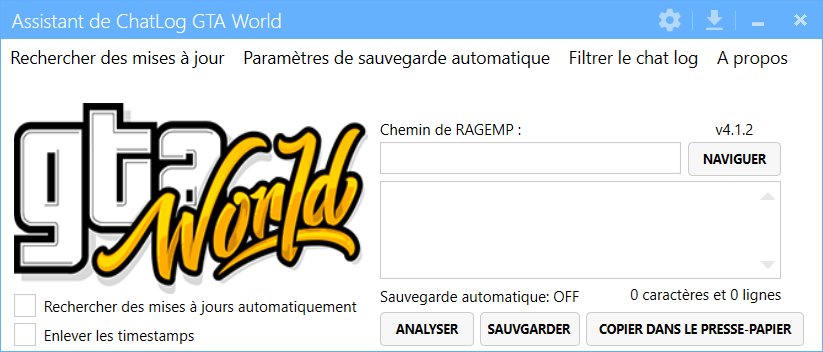

# Assistant de Chatlog GTA World
Ce programme est utilisé pour convertir les logs générés durant votre session de jeu sur GTA World en texte lisible.

## Commencer

Aucune installation n'est requise. Téléchargez simplement la dernière version du [release](https://github.com/therealoggY/GTAWFrance-Assistant-Chatlog/releases) et éxecutez l'executable.

## Building

Les dépendances du package NuGet doivent être restaurées avant de compiler le projet. 

## Contribution

1. Fork Project (<https://github.com/your_name/GTAW-Log-Parser>)
2. Create Branch (`git checkout -b branch_name`)
3. Commit (`git commit -am "Add feature_name"`)
4. Push (`git push origin branch_name`)
5. Create Pull Request

## Roadmap

- Switch to .NET Core 4.8, then .NET 5 (when available)

## Crédits

- All the credits goes to @MapleToo, you can find the original project on : https://github.com/MapleToo/GTAW-Log-Parser

## Additional Information

Distributed under the GPLv3 license. See ``LICENSE`` for more information.
